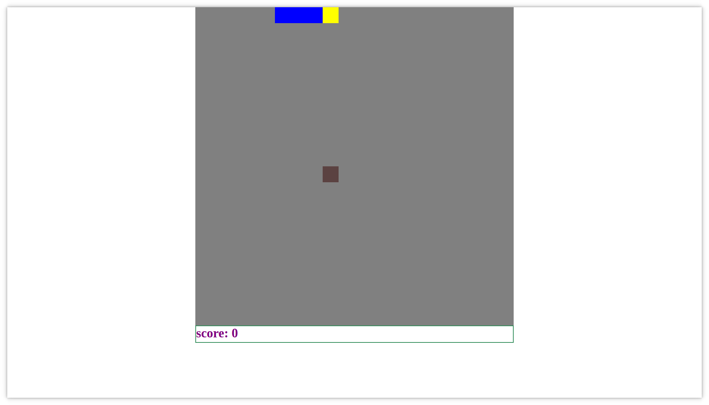
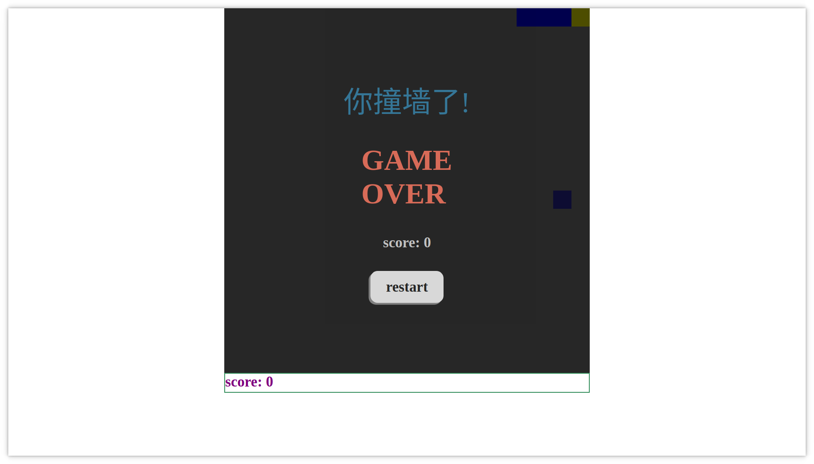
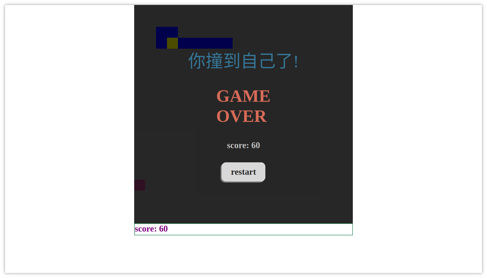

## 对贪吃蛇游戏的改写（js -> ts)

<svg xmlns="http://www.w3.org/2000/svg" xmlns:xlink="http://www.w3.org/1999/xlink" width="110" height="20" role="img" aria-label="typescript: v4.5.4"><title>typescript: v4.5.4</title><linearGradient id="s" x2="0" y2="100%"><stop offset="0" stop-color="#bbb" stop-opacity=".1"/><stop offset="1" stop-opacity=".1"/></linearGradient><clipPath id="r"><rect width="110" height="20" rx="3" fill="#fff"/></clipPath><g clip-path="url(#r)"><rect width="65" height="20" fill="#555"/><rect x="65" width="45" height="20" fill="#97ca00"/><rect width="110" height="20" fill="url(#s)"/></g><g fill="#fff" text-anchor="middle" font-family="Verdana,Geneva,DejaVu Sans,sans-serif" text-rendering="geometricPrecision" font-size="110"><text aria-hidden="true" x="335" y="150" fill="#010101" fill-opacity=".3" transform="scale(.1)" textLength="550">typescript</text><text x="335" y="140" transform="scale(.1)" fill="#fff" textLength="550">typescript</text><text aria-hidden="true" x="865" y="150" fill="#010101" fill-opacity=".3" transform="scale(.1)" textLength="350">v4.5.4</text><text x="865" y="140" transform="scale(.1)" fill="#fff" textLength="350">v4.5.4</text></g></svg>

<svg xmlns="http://www.w3.org/2000/svg" xmlns:xlink="http://www.w3.org/1999/xlink" width="112" height="20" role="img" aria-label="webpack: v5.66.0"><title>webpack: v5.66.0</title><linearGradient id="s" x2="0" y2="100%"><stop offset="0" stop-color="#bbb" stop-opacity=".1"/><stop offset="1" stop-opacity=".1"/></linearGradient><clipPath id="r"><rect width="112" height="20" rx="3" fill="#fff"/></clipPath><g clip-path="url(#r)"><rect width="59" height="20" fill="#555"/><rect x="59" width="53" height="20" fill="#a4a61d"/><rect width="112" height="20" fill="url(#s)"/></g><g fill="#fff" text-anchor="middle" font-family="Verdana,Geneva,DejaVu Sans,sans-serif" text-rendering="geometricPrecision" font-size="110"><text aria-hidden="true" x="305" y="150" fill="#010101" fill-opacity=".3" transform="scale(.1)" textLength="490">webpack</text><text x="305" y="140" transform="scale(.1)" fill="#fff" textLength="490">webpack</text><text aria-hidden="true" x="845" y="150" fill="#010101" fill-opacity=".3" transform="scale(.1)" textLength="430">v5.66.0</text><text x="845" y="140" transform="scale(.1)" fill="#fff" textLength="430">v5.66.0</text></g></svg>

<svg xmlns="http://www.w3.org/2000/svg" xmlns:xlink="http://www.w3.org/1999/xlink" width="120" height="20" role="img" aria-label="webpack-cli: v4.9.1"><title>webpack-cli: v4.9.1</title><linearGradient id="s" x2="0" y2="100%"><stop offset="0" stop-color="#bbb" stop-opacity=".1"/><stop offset="1" stop-opacity=".1"/></linearGradient><clipPath id="r"><rect width="120" height="20" rx="3" fill="#fff"/></clipPath><g clip-path="url(#r)"><rect width="75" height="20" fill="#555"/><rect x="75" width="45" height="20" fill="#007ec6"/><rect width="120" height="20" fill="url(#s)"/></g><g fill="#fff" text-anchor="middle" font-family="Verdana,Geneva,DejaVu Sans,sans-serif" text-rendering="geometricPrecision" font-size="110"><text aria-hidden="true" x="385" y="150" fill="#010101" fill-opacity=".3" transform="scale(.1)" textLength="650">webpack-cli</text><text x="385" y="140" transform="scale(.1)" fill="#fff" textLength="650">webpack-cli</text><text aria-hidden="true" x="965" y="150" fill="#010101" fill-opacity=".3" transform="scale(.1)" textLength="350">v4.9.1</text><text x="965" y="140" transform="scale(.1)" fill="#fff" textLength="350">v4.9.1</text></g></svg>

<svg xmlns="http://www.w3.org/2000/svg" xmlns:xlink="http://www.w3.org/1999/xlink" width="76" height="20" role="img" aria-label="less: v4.1.2"><title>less: v4.1.2</title><linearGradient id="s" x2="0" y2="100%"><stop offset="0" stop-color="#bbb" stop-opacity=".1"/><stop offset="1" stop-opacity=".1"/></linearGradient><clipPath id="r"><rect width="76" height="20" rx="3" fill="#fff"/></clipPath><g clip-path="url(#r)"><rect width="31" height="20" fill="#555"/><rect x="31" width="45" height="20" fill="#e05d44"/><rect width="76" height="20" fill="url(#s)"/></g><g fill="#fff" text-anchor="middle" font-family="Verdana,Geneva,DejaVu Sans,sans-serif" text-rendering="geometricPrecision" font-size="110"><text aria-hidden="true" x="165" y="150" fill="#010101" fill-opacity=".3" transform="scale(.1)" textLength="210">less</text><text x="165" y="140" transform="scale(.1)" fill="#fff" textLength="210">less</text><text aria-hidden="true" x="525" y="150" fill="#010101" fill-opacity=".3" transform="scale(.1)" textLength="350">v4.1.2</text><text x="525" y="140" transform="scale(.1)" fill="#fff" textLength="350">v4.1.2</text></g></svg>

### webpack 配置

~~~webpack
const path = require('path')
const HTMLWebpackPlugin = require("html-webpack-plugin")
module.exports = {
    mode: 'development',
    entry: "./src/index.ts",
    output: {
        path: path.resolve(__dirname, 'dist'),
        filename: "bundle.js",
        clean: true
    },
    devtool: 'inline-source-map',
    devServer: {
        static: './dist',
    },
    module: {
        rules: [
            {
                test: /\.tsx?$/i,
                use: 'ts-loader',
                exclude: /node_modules/
            },
            {
                test: /\.(css|less)$/i,
                use: ['style-loader', 'css-loader', 'less-loader'],
            }
        ]
    },
    resolve: {
        extensions: ['.tsx', '.ts', '.js'],
    },
    plugins: [
        new HTMLWebpackPlugin({
            title: 'Development'
        })
    ]
}
~~~

